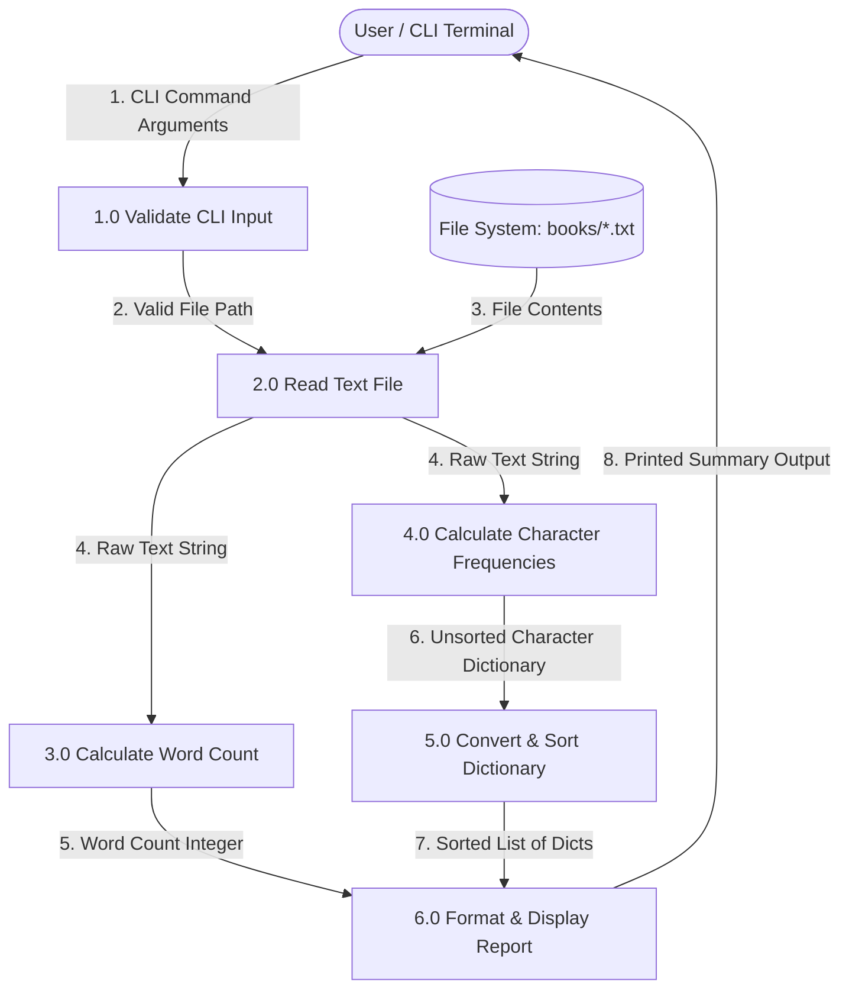

# BookBot - Project Notebook

**Student Name:** [Your Name]  
**Course:** Year 9 Computing Technology  
**Project:** Unit 03 - Build a Bookbot  
**Weighting:** 20%  

---

## 1. Input-Process-Output (IPO) Table

| Module / Function | Input | Process | Output |
| :--- | :--- | :--- | :--- |
| **CLI Argument Parsing** (`main`) | `sys.argv` (Command-line arguments) | Checks if file path argument is present (`len(sys.argv) < 2`). If missing, displays usage message and exits program (`sys.exit(1)`). | `book_path` (String containing file path) |
| **File Reading** (`get_book_text`) | `path` (String path to book file) | Opens file using context manager (`open(path)`), reads full content into memory, and handles `FileNotFoundError` gracefully. | `text` (String containing entire file contents) |
| **Word Counting** (`get_num_words`) | `text` (String) | Splits raw text string into a list of words using whitespace delimiter (`text.split()`) and measures list length. | `num_words` (Integer representing total word count) |
| **Character Frequency Analysis** (`get_chars_dict`) | `text` (String) | Iterates through each character in text, converts to lowercase (`c.lower()`), and accumulates frequency counts in a dictionary. | `chars` (Dictionary with key-value pairs of `char: count`) |
| **Dictionary Sorting** (`chars_dict_to_sorted_list` & `sort_on`) | `num_chars_dict` (Dictionary of character frequencies) | Converts dictionary key-value pairs into a list of dictionaries (`[{"char": ch, "num": count}]`). Sorts list in descending order by `num` key. | `sorted_list` (List of dictionaries sorted by highest character frequency) |
| **Report Generation** (`print_report`) | `book_path` (String), `num_words` (Integer), `sorted_chars` (List of dicts) | Formats terminal header. Iterates through sorted characters, filters for alphabetic characters (`char.isalpha()`), and prints formatted line outputs. | Formatted terminal output report |

---

## 2. Data Flow Diagram (DFD)



### DFD Component Breakdown

1. **External Entities**
   * **User / CLI Terminal:** Passes command-line arguments to the application and receives stdout report outputs.
2. **Processes**
   * **1.0 Validate CLI Input (`main`):** Verifies required file path arguments (`sys.argv[1]`) before starting processing.
   * **2.0 Read Text File (`get_book_text`):** Loads text content into memory with error handling for missing files.
   * **3.0 Calculate Word Count (`get_num_words`):** Splits text by whitespace tokens to count total words.
   * **4.0 Calculate Character Frequencies (`get_chars_dict`):** Maps lowercase character occurrences in a hash table.
   * **5.0 Convert & Sort Dictionary (`chars_dict_to_sorted_list` & `sort_on`):** Re-structures hash table items into a list of single-pair dictionaries and sorts them descending by frequency.
   * **6.0 Format & Display Report (`print_report`):** Filters non-alphabetic keys and prints formatted stats to the terminal screen.
3. **Data Stores**
   * **File System (`books/*.txt`):** Disk storage containing target books (`frankenstein.txt`, `mobydick.txt`, `prideandprejudice.txt`).

---

## 3. Design Decisions and Justifications

### 1. Separation of Concerns (Modular Architecture)
* **Decision:** Split the codebase into two distinct files: `main.py` for CLI execution and display logic, and `stats.py` for mathematical and text processing routines[cite: 1].
* **Justification:** Tightly coupling file input/output with data processing makes code fragile and hard to unit test[cite: 1]. Pure functions inside `stats.py` can be tested independently without relying on file systems or command-line execution[cite: 1].

### 2. Two-Phase Data Processing (Dictionary to Sorted List)
* **Decision:** Accumulate character counts inside a dictionary first, then transform key-value pairs into a list of dictionary objects for sorting[cite: 1].
* **Justification:** Hash maps provide fast $O(1)$ lookup times when counting characters across massive text blocks. Converting data into a list of structured objects (`[{"char": c, "num": n}]`) allows clean sorting via Python's native `sort()` method using a custom extraction key (`sort_on`)[cite: 1].

### 3. Deferred Filtering over Early Elimination
* **Decision:** Record all raw character occurrences (including spaces and punctuation) inside `get_chars_dict()`, but filter for alphabetic characters (`char.isalpha()`) inside `print_report()`[cite: 1].
* **Justification:** Keeping core counting logic free of display rules preserves data integrity. `stats.py` remains reusable for other tasks requiring raw character counts without needing modifications[cite: 1].

### 4. Immediate Lowercase Normalization
* **Decision:** Call `.lower()` on every character during dictionary insertion[cite: 1].
* **Justification:** Character statistics require case-insensitive grouping so 'E' and 'e' count toward the same bucket[cite: 1]. Normalizing data immediately avoids duplicate key generation and eliminates secondary dictionary merging logic.

### 5. Guard Clauses and File Handling Exception Interception
* **Decision:** Use explicit argument length checks (`len(sys.argv) < 2`) and `try-except FileNotFoundError` blocks inside `main.py`[cite: 1].
* **Justification:** Prevents raw Python stack traces from cluttering the terminal when users enter bad arguments or missing paths, returning clean error guidance instead[cite: 1].

---

## 4. Test Cases and Verification

### Unit Test Suite (`test_stats.py`)

```python
import unittest
from stats import get_num_words, get_chars_dict, chars_dict_to_sorted_list


class TestBookBotStats(unittest.TestCase):

    # Test Case 1: Word Count Standard Execution (Happy Path)
    def test_get_num_words_returns_correct_count(self):
        sample_text = "The quick brown fox jumps over the lazy dog."
        expected_word_count = 9
        actual_word_count = get_num_words(sample_text)
        self.assertEqual(actual_word_count, expected_word_count)

    # Test Case 2: Word Count Empty String (Edge Case)
    def test_get_num_words_empty_string_returns_zero(self):
        sample_text = ""
        expected_word_count = 0
        actual_word_count = get_num_words(sample_text)
        self.assertEqual(actual_word_count, expected_word_count)

    # Test Case 3: Character Frequency & Lowercase Normalization (Happy Path)
    def test_get_chars_dict_counts_characters_and_normalizes_case(self):
        sample_text = "Aa Bb 123!"
        expected_dict = {
            "a": 2,
            " ": 2,
            "b": 2,
            "1": 1,
            "2": 1,
            "3": 1,
            "!": 1,
        }
        actual_dict = get_chars_dict(sample_text)
        self.assertEqual(actual_dict, expected_dict)

    # Test Case 4: Character Frequency Non-Alphabetic Only (Edge Case)
    def test_get_chars_dict_handles_non_alphabetic_only(self):
        sample_text = "1234!! @@"
        expected_dict = {
            "1": 1,
            "2": 1,
            "3": 1,
            "4": 1,
            "!": 2,
            " ": 1,
            "@": 2,
        }
        actual_dict = get_chars_dict(sample_text)
        self.assertEqual(actual_dict, expected_dict)

    # Test Case 5: Character Dictionary Sorting Order (Happy Path)
    def test_chars_dict_to_sorted_list_sorts_descending_by_frequency(self):
        input_dict = {"a": 5, "b": 12, "c": 2, "d": 8}
        expected_list = [
            {"char": "b", "num": 12},
            {"char": "d", "num": 8},
            {"char": "a", "num": 5},
            {"char": "c", "num": 2},
        ]
        actual_list = chars_dict_to_sorted_list(input_dict)
        self.assertEqual(actual_list, expected_list)


if __name__ == "__main__":
    unittest.main()
```

### System Integration Test Executions

#### Test Execution 1: Full Book Analysis (`books/frankenstein.txt`)
* **Input Command:** `python3 main.py books/frankenstein.txt`
* **Expected Result:** Reports total word count (75,757) and correctly sorted alphabetic character frequencies[cite: 1].
* **Actual Result:** Passed cleanly with full formatted report.

#### Test Execution 2: Missing Argument Error Verification
* **Input Command:** `python3 main.py`
* **Expected Result:** Terminal displays `Usage: python3 main.py <path_to_book>` and exits with status code 1.
* **Actual Result:** Passed without raw exception traces.

#### Test Execution 3: Non-Existent File Path Interception
* **Input Command:** `python3 main.py books/missing_file.txt`
* **Expected Result:** Terminal displays `Error: The file at 'books/missing_file.txt' could not be found.` and terminates safely.
* **Actual Result:** Passed cleanly without throwing an unhandled `FileNotFoundError`.

---

## 5. Reflection on Challenges and Solutions

### Challenge 1: Custom List Sorting with Dictionary Objects
* **Problem:** Raw Python dictionaries cannot be sorted by value directly while preserving cleaner key structures for formatting[cite: 1].
* **Solution:** Re-structured character counts into single-pair dictionary records inside a standard list (`[{"char": key, "num": val}]`)[cite: 1]. Built a helper function (`sort_on`) to supply Python's native `.sort()` method with an explicit sort key, ordering character counts descending in $O(N \log N)$ time[cite: 1].

### Challenge 2: Separating Analysis from Display Rules
* **Problem:** Stripping punctuation or spaces inside `stats.py` would hardcode presentation decisions directly into the computational module, reducing code reusability[cite: 1].
* **Solution:** Kept `get_chars_dict()` focused purely on tallying every character, deferring alphabetic filtering (`char.isalpha()`) to `print_report()` inside `main.py`[cite: 1]. This keeps statistical functions clean while satisfying display criteria.

### Challenge 3: Defensive CLI Error Interception
* **Problem:** Invoking the tool with bad file paths or missing arguments caused raw Python exceptions (`IndexError`, `FileNotFoundError`) to leak into the terminal interface[cite: 1].
* **Solution:** Implemented argument length checks and wrapped open file operations in explicit `try-except` blocks to handle missing inputs safely[cite: 1].
